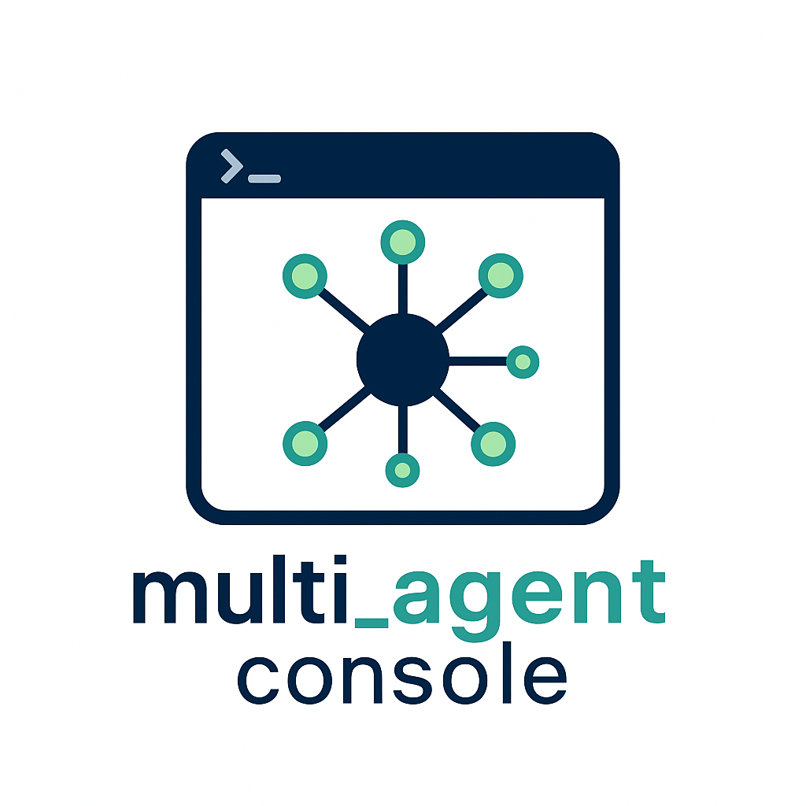

# MultiAgentConsole

A powerful terminal-based multi-agent system powered by Google's Agent Development Kit (ADK).



## Overview

MultiAgentConsole is a sophisticated terminal-based interface for interacting with multiple specialized AI agents. It leverages Google's Agent Development Kit (ADK) to provide a flexible, powerful environment for various tasks including coding assistance, research, system administration, and data analysis.

The system uses a coordinator agent to route requests to specialized agents, each with domain-specific knowledge and capabilities. This multi-agent architecture allows for more accurate, contextual responses across a wide range of tasks.

## Key Features

- **Multi-Agent Architecture**: Specialized agents for different domains (coding, research, system administration, data analysis) coordinated by a root agent
- **Terminal Interface**: Clean, responsive terminal UI built with Textual
- **Flexible Model Support**: Support for various LLM providers through Google's ADK
- **Dynamic Configuration**: Change models and agent settings on-the-fly
- **Advanced Tool Integration**: Built-in tools for Git, databases, APIs, and more
- **Communication Protocols**: MCP server and A2A protocol support
- **Thought Graph Analysis**: Identify gaps in thinking and improve queries

## Documentation

Comprehensive documentation is available in the following files:

- **[Product Brief](Product_Brief.md)** - Overview, key features, target users, and benefits
- **[Design Document](Design_Document.md)** - Technical architecture and implementation details
- **[Architecture Diagram](Architecture_Diagram.md)** - Visual representation of system components
- **[Feature Matrix](Feature_Matrix.md)** - Complete list of features with implementation status
- **[Use Cases](Use_Cases.md)** - Illustrated examples with input/output scenarios

## Installation

```bash
# Clone the repository
git clone https://github.com/ssvgopal/multi_agent_console.git
cd multi_agent_console

# Install the package
pip install -e .
```

## Usage

```bash
# Run the console
multi-agent-console
```

### Basic Commands

```
/help                   # Show available commands
/switch [agent_name]    # Switch to a different agent
/config                 # Edit configuration
/memory                 # View conversation history
/clear                  # Clear current conversation
/exit                   # Exit the console
```

## Configuration

The application uses `config.json` to define settings:

```json
{
  "model": "gemini-2.0-pro",
  "agents": {
    "coordinator": {
      "name": "Coordinator",
      "description": "Routes requests to specialized agents"
    },
    "code_assistant": {
      "name": "Code Assistant",
      "description": "Helps with programming tasks"
    },
    "research_assistant": {
      "name": "Research Assistant",
      "description": "Finds and synthesizes information"
    }
  }
}
```

You can edit this file directly or via the "Edit Config" button within the app.

## Feature Highlights

### Multi-Agent System

The console uses a coordinator agent to route requests to specialized agents:

- **Code Assistant**: Programming and development help
- **Research Assistant**: Information retrieval and synthesis
- **System Assistant**: System administration tasks
- **Data Assistant**: Data analysis and visualization

### Communication Protocols

- **MCP Server**: Multi-agent Communication Protocol for message routing
- **A2A Protocol**: Agent-to-Agent protocol for standardized task delegation
- **Plugin System**: Extend functionality with custom plugins

### Thought Graph Analysis

Analyze queries as concept networks to identify gaps in thinking:

- Detect missing connections between concepts
- Visualize thought graphs
- Generate improved query suggestions

## Contributing

Contributions to MultiAgentConsole are welcome! Please refer to the project's GitHub repository for contribution guidelines.

## License

MultiAgentConsole is released under the MIT License.
